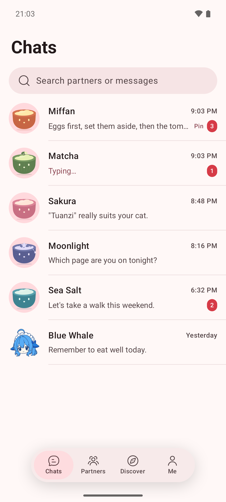
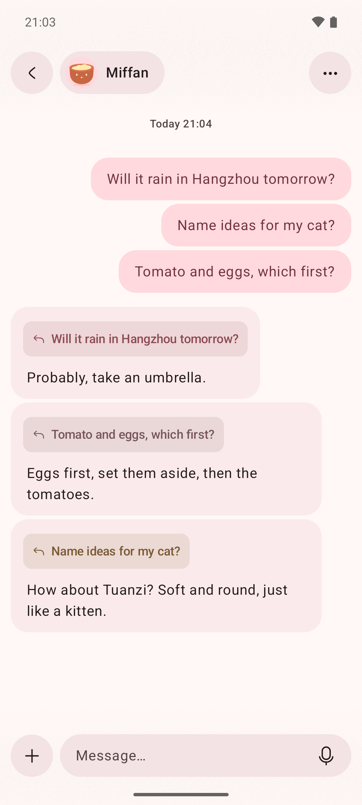
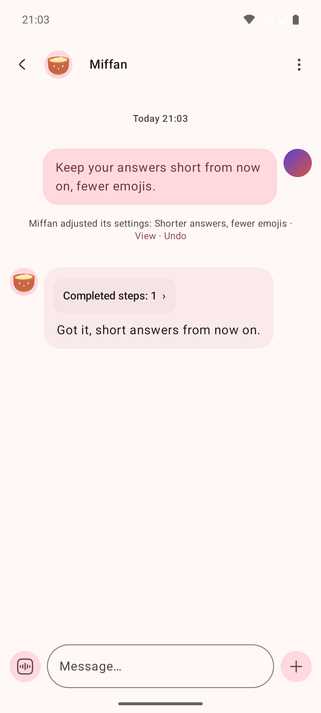

<div align="center">
  
  <h1>Miffan</h1>
  <p>An Android AI app you talk to like a friend, and that can work on your computer.</p>

  <p>
    <a href="https://github.com/Ayuilos/Miffan/releases"></a>
    
    <a href="LICENSE"></a>
  </p>

  <p>English · <a href="README_ZH_CN.md">简体中文</a> · <a href="README_ZH_TW.md">繁體中文</a></p>
</div>

<table>
  <tr>
    <td align="center" valign="top"></td>
    <td align="center" valign="top"></td>
    <td align="center" valign="top"></td>
  </tr>
</table>

Bring the AI service you already use, whether that's an API key for an OpenAI-compatible, Gemini or Claude service, or a ChatGPT subscription through Codex sign-in. Miffan doesn't bundle a model. Your chats and settings stay on your phone.

## Chat like a messenger

Each AI partner is one ongoing chat. There's nothing to start, no model to pick and nothing to tune.

- **One partner, one conversation.** Your history with a partner reads as one timeline across days. Behind the scenes Miffan keeps topics apart, so long chats stay quick and on point.
- **Ask several things at once.** Unrelated questions run in parallel, and each reply quotes the message it answers.
- **Change a partner by telling it.** "Keep your answers shorter" adjusts its preferences. Every change to a partner's settings or memory is linked to the message behind it, kept in a history and can be undone.
- **See what AI knows about you.** Each memory shows where it came from, and you can delete it at any time.

## Let your partner use your computer · new in 4.0

Connect a Mac or Linux desktop over SSH, including over Tailscale, and your partner can open apps, type and click on it while you watch from your phone.

- **One shared screen.** View and control the desktop from your phone. Touch the screen and you take over right away.
- **You stay in charge.** By default the partner asks before every action. Each approval is recorded in a permission history that stays even if you delete the chat.
- **Guided setup.** Easy chat walks you through connecting a computer, checking that it's ready and handing it to a partner.

Supported desktops: macOS, Linux with wlroots-based Wayland (such as niri, Sway or Hyprland), and X11. GNOME and KDE aren't supported yet.

## Professional mode when you want every option

Switch to the professional interface at any time. It uses the same data as easy chat.

- Combine official APIs, compatible gateways, self-hosted endpoints and a Codex subscription.
- Give each assistant its own prompts, model parameters, memory, MCP servers, Skills and web search.
- Run a local Linux workspace on the phone, or let assistants work on remote servers over SSH with files and a terminal.
- Use voice input and output, translate selected text in any app, and chat from a browser on your network.

The [feature matrix](docs/FEATURE_MATRIX.md) lists every supported provider, search service, speech engine and tool.

## Characters with feelings

<p align="center">
  
</p>

Choose a Miffan rice bowl or the blue whale girl. Their expressions follow the conversation: they eat while you wait, get dizzy while the AI reasons, smile when a reply arrives and doze off at night.

## Get started

1. Download the latest APK from [GitHub Releases](https://github.com/Ayuilos/Miffan/releases). Official builds are for `arm64-v8a` devices on Android 8.0 or later.
2. On first launch, connect an AI service with an API key or sign in with a supported account.
3. Start chatting.

You can back up to WebDAV or S3-compatible storage, and import data from RikkaHub, Chatbox and Cherry Studio. Prompts, attachments and tool data go only to the services you configure; see [PRIVACY.md](PRIVACY.md) and [SECURITY.md](SECURITY.md).

## Project history

Miffan started as a fork of [RikkaHub](https://github.com/rikkahub/rikkahub), an open-source Android LLM client, and has since grown into an independent app.

| When | Release | What changed |
| --- | --- | --- |
| Aug 2026 | 2.4.10-miffan.1 | Forked from RikkaHub 2.4.10 and renamed Miffan, with its own app ID so it installs alongside RikkaHub. Added ChatGPT subscription sign-in through Codex. |
| Aug 2026 | 2.4.10-miffan.5 | The animated Miffan bowl characters arrived. |
| Aug 2026 | 3.0.0 | Moved to Miffan's own version numbers, independent of RikkaHub releases. |
| Sep 2026 | 3.1 – 3.3 | First-run setup, encrypted credentials, persistent reply branches and the blue whale girl. |
| Sep 2026 | 3.4 | Remote SSH workspaces. |
| Oct 2026 | 4.0 | Easy chat and letting your partner use your computer. |

Miffan still takes in selected RikkaHub improvements. Each one is reviewed and listed separately in the release notes (see the [upstream sync policy](docs/upstream-sync.md)). Upstream copyright and attribution are kept as the license requires. Miffan is not an official RikkaHub release.

## Build and contribute

```bash
git clone https://github.com/Ayuilos/Miffan.git
cd Miffan
./gradlew assembleDebug
```

The project uses Kotlin, Jetpack Compose and Java 17. Read the [contribution guidelines](CONTRIBUTING.md) and [issue guidelines](docs/ISSUE_GUIDELINES.md) before opening a pull request. Release and signing steps are in [docs/releasing.md](docs/releasing.md).

Miffan is licensed under the [GNU Affero General Public License v3.0](LICENSE).
