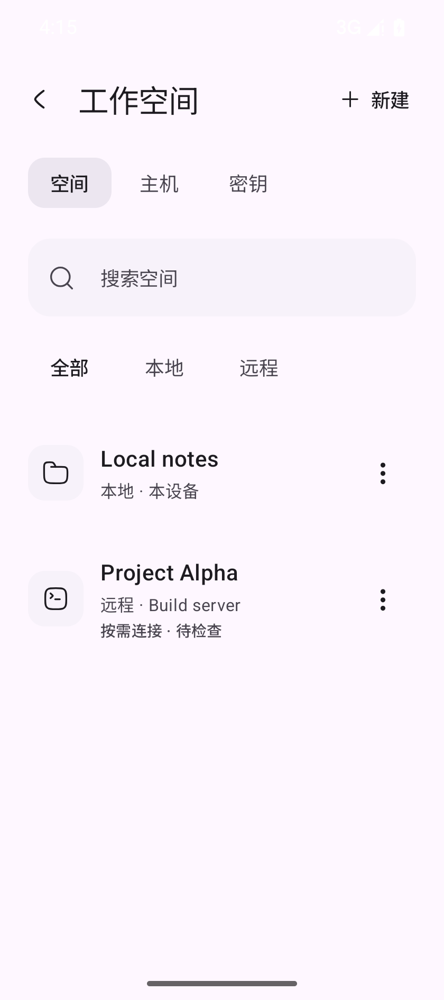
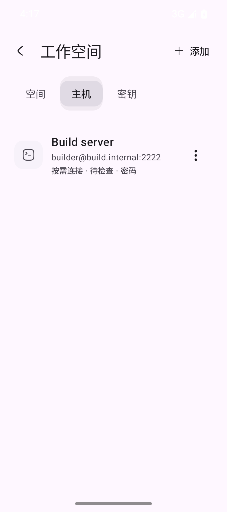
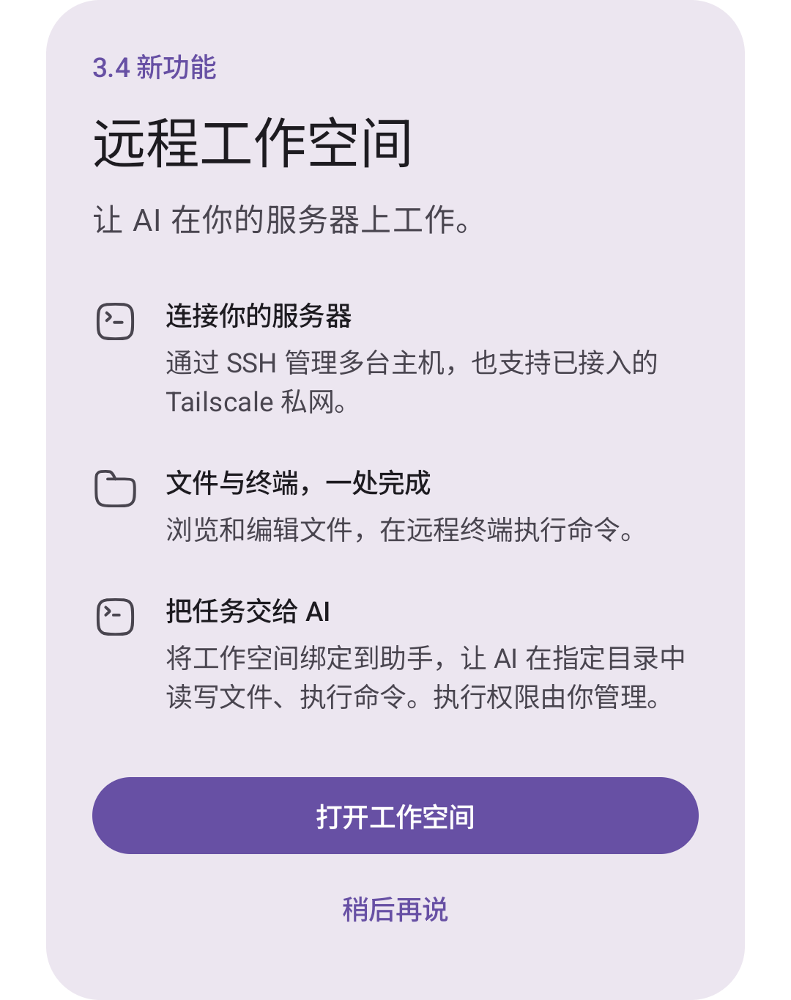

<div align="center">
  
  <h1>Miffan</h1>
  <p>把模型、助手、工具与本地、远程工作空间装进手机的原生 Android AI 客户端。</p>

  <p>
    <a href="https://github.com/Ayuilos/Miffan/releases"></a>
    
    <a href="LICENSE"></a>
  </p>

  <p><a href="README.md">English</a> · 简体中文 · <a href="README_ZH_TW.md">繁體中文</a></p>
</div>

Miffan 是为 Android 打造的开源 AI 工作空间。你可以连接自己正在使用的模型服务，为不同助手配置独立的提示词、记忆、工具和性格，并在一个原生 APP 中管理对话与文件。

你可以通过 API Key 连接 OpenAI 兼容、Gemini 或 Claude 服务，也可以使用符合条件的 ChatGPT 订阅登录 Codex。Miffan 本身不内置模型，也不替代模型服务账号；具体可用能力和费用取决于你配置的服务。

## 为什么选择 Miffan

- **不同模型，一个入口。** 官方 API、兼容网关、自部署端点和 Codex 订阅可以共存，不必把工作流绑定在单一供应商上。
- **助手不只是提示词。** 每个助手都能拥有独立的模型参数、记忆、工具、MCP、Skills、视觉形象与对话历史。
- **手机不只是聊天窗口。** Miffan 可以搜索网页、处理文件、运行本地 Linux 工作区、通过 SSH 连接远程服务器、使用设备能力，还能通过浏览器访问同一套对话。
- **有意义的角色系统。** 可选择定制化 Miffan 碗角色或蓝色大肥鱼，让动作神态响应聊天状态与昼夜变化。

## 远程工作空间 · 3.4 新功能

通过 SSH 连接自己的服务器，让助手在指定项目目录中处理任务。本地项目与远程机器可以在同一个 APP 中管理，清楚区分位置与连接状态。

- **多主机、多项目。** 统一管理 SSH 主机、认证信息与项目目录，也可连接手机已经接入的 Tailscale 私网机器。
- **文件与交互式终端。** 浏览、预览、编辑、导入导出远程文件，或打开持续会话的终端手动执行命令；预览返回后保留当前目录。
- **让 AI 在文件所在的位置工作。** 为助手绑定工作空间后，即可使用文件与 Shell 工具。本地与远程目标分别管理 AI Shell 权限和执行确认。
- **SSH 密钥管理。** 支持生成和导入密钥、复制公钥、查看与导出私钥；备份时可选择口令加密。

从**工作空间 → 新建 → 远程**选择主机与项目目录，再到助手设置中绑定工作空间。首次展示的新功能弹窗也可直接打开工作空间管理页。

<table>
  <tr>
    <td align="center" valign="top"></td>
    <td align="center" valign="top"></td>
    <td align="center" valign="top"></td>
  </tr>
  <tr>
    <td align="center">本地与远程项目</td>
    <td align="center">SSH 主机管理</td>
    <td align="center">新功能介绍与入口</td>
  </tr>
</table>

截图使用演示主机与项目数据。

目前支持 Linux/Unix SSH/SFTP 主机。APP 使用已有网络连接，不负责配置 Tailscale，也不提供手机离线后的自主任务托管。配置步骤与当前限制见[远程工作空间说明](docs/REMOTE_WORKSPACE.md)。

## 认识蓝色大肥鱼

<p align="center">
  
  <br /><em>Miffan 与蓝色大肥鱼 · 角色插画</em>
</p>

**蓝色大肥鱼**是一位乐观、爱吃饭的新伙伴，与原有的 Miffan 碗角色并存。在**设置 → 外观**中预览主题，即可体验她的专属助手。

- **独立的专属助手。** 首次体验会创建大肥鱼助手并打开新对话，再次体验会复用已有助手、保留你的修改。名字、性格提示词、模型和工具均可编辑，原有助手和对话保持不变。
- **跟随聊天的动作神态。** 微笑、摸摸、得意、更新提醒、等待时吃饭、输出时咀嚼、实际推理时摇晃并转圈眼，以及带呼吸鼻涕泡的睡眠。原生绘图保持头像外透明，并支持减弱动态。
- **配套外观。** 鲜蓝头发、鲸鳍和蝴蝶结搭配浅色与深色主题、新手引导预览和启动画面；碗与大肥鱼桌面图标可独立选择。恢复之前的配色会保留专属助手。
- **随时体验。** 新安装可在引导中选择，已有用户会在聊天首页看到一次介绍；也可单独为某个助手选择大肥鱼头像。

## 界面预览

<table>
  <tr>
    <td align="center"></td>
    <td align="center"></td>
    <td align="center"></td>
  </tr>
  <tr>
    <td align="center">动态角色</td>
    <td align="center">角色定制</td>
    <td align="center">工具调用</td>
  </tr>
</table>

### 划词翻译流程

在任意 Android APP 中选中文字，从文字操作菜单选择 **Miffan-翻译**（菜单名称跟随 APP 语言），即可在不离开当前页面的情况下，通过小型悬浮窗口查看翻译结果。

<table>
  <tr>
    <td align="center"></td>
    <td align="center"></td>
  </tr>
  <tr>
    <td align="center">1. 选中文字并选择 Miffan-翻译</td>
    <td align="center">2. 查看或复制翻译结果</td>
  </tr>
</table>

## 功能

### 模型与供应商

- 支持 OpenAI Chat Completions / Responses 兼容服务、Google Gemini / Vertex AI，以及 Anthropic Claude 兼容服务
- 使用符合条件的 ChatGPT 订阅，通过浏览器登录 OpenAI Codex
- 内置常见官方服务与网关预设，也可自定义供应商、Base URL、模型、请求路径、Headers 与 Body 参数
- 支持模型发现，并可配置模态、推理、工具调用、上下文窗口与生成参数
- 支持带认证的 HTTP/SOCKS5 代理、自定义 User-Agent、连接测试和可选的余额查询
- 根据模型能力提供聊天、推理、工具调用、图像生成与多模态输入

### 对话体验

- 流式输出、消息编辑与重新生成、回复分支、收藏、文件夹和本地全文搜索
- 对话级系统提示词、历史压缩、自动标题、追问建议、Token 用量与生成统计
- 支持图片和文档附件；必要时可在本地提取 PDF、DOCX、PPTX 与 EPUB 文本
- 富 Markdown 与 HTML 渲染，支持代码高亮、LaTeX、表格、Mermaid、图片与 Diff
- 对话可导出为 Markdown 或图片，也可从 Android 分享内容并交给指定助手处理

### 助手与 Miffan 角色

- 每个助手可独立配置模型、提示词、采样参数、上下文限制、自定义请求与聊天背景
- 支持记忆、引用近期对话、预设消息、快捷消息、正则转换、模式注入与世界书
- 支持导入 JSON 或 PNG 格式的酒馆角色卡
- 四种 Miffan 角色、六套精选配色、三种动作风格，并可选择跟随 APP 主题配色
- 针对待机、思考、成功、错误、输入、提交、点击与昼夜场景的语义动画，并支持减少动态效果

### 工具与扩展

- 支持基于 SSE 或 Streamable HTTP 的 MCP，包括 OAuth 流程和按助手选择服务器
- 可从文件、GitHub 仓库和 Skill.sh 目录安装并管理 Skills，并对安装目标进行约束
- 可接入 Bing、Tavily、Exa、SearXNG、Brave、Perplexity、Firecrawl、Jina、Grok 等搜索服务，也支持自定义 JavaScript 搜索适配器
- 可选本地工具包括时间、剪贴板、JavaScript、文字转语音、向用户提问、屏幕使用时间与日历事件
- 本地 Linux 与远程 SSH 工作空间，包含文件管理、编辑器、交互式终端、工作目录上下文与 AI 文件/命令工具

### 语音、翻译与浏览器访问

- 可配置 OpenAI Realtime、DashScope、火山引擎、MiMo 与阶跃星辰语音识别
- 支持 Android 系统语音，以及 OpenAI、OpenRouter、Gemini、MiniMax、Qwen、Groq、xAI、MiMo、ElevenLabs、Fish Audio、阶跃星辰等 TTS 服务
- 内置 AI 翻译，并支持通过 Android“处理文字”在小型悬浮窗口中翻译选中文本
- 可选本地 Web 服务器，支持本机或局域网浏览器访问、密码认证、仅本机监听与 mDNS 发现

### 数据与迁移

- 对话与设置保存在 APP 本地数据库中
- 支持选择内容的本地备份与恢复、备份提醒、WebDAV 和 S3 兼容存储
- 可从 Chatbox 导入供应商与完整对话、从 Cherry Studio 导入供应商，也可导入兼容的 RikkaHub 备份
- 使用独立的应用 ID、签名身份、发布渠道与深链协议，可与 RikkaHub 同时安装

完整的模型协议、搜索、语音、工具与迁移支持情况见[功能兼容矩阵](docs/FEATURE_MATRIX.md)。

## 下载与首次配置

Miffan 目前通过 [GitHub Releases](https://github.com/Ayuilos/Miffan/releases) 发布签名 APK。正式版本面向运行 Android 8.0 或更高版本的 `arm64-v8a` 设备。

1. 安装最新的 Miffan APK。
2. 打开 **设置 → 供应商** 配置模型服务，或使用支持的订阅登录 OpenAI Codex。
3. 添加或发现模型，再将其设为全局模型或某个助手的专属模型。
4. 仅在需要时启用搜索、MCP、Skills、本地工具或工作区。

Miffan 的应用 ID 为 `me.ayuilos.miffan.app`，深链协议为 `miffan://`。RikkaHub 的已有数据不会自动共享；如需迁移，请先在旧 APP 中导出备份，再导入 Miffan。

从 `3.0.0-rc.1` 起，Miffan 使用不再编码 RikkaHub 版本的独立 SemVer 发布线。正式 APK 保留既有包名和生产签名身份，因此 `2.4.11-miffan.1` 可在不改变用户数据或数据库兼容策略的前提下原地升级。Nightly 工作流产物使用 `me.ayuilos.miffan.app.nightly` 和 CI 临时 debug 签名，只能独立安装，不能覆盖正式版。Nightly 属于一次性测试产物；不同运行的签名可能变化，因此不保证 Nightly 之间可以原地升级。

## 安全与隐私说明

Miffan 是客户端：提示词、附件和工具数据会发送到你选择的模型、搜索、语音、MCP、同步或其他服务端点。请分别了解所配置服务的隐私政策和计费方式。详细数据流说明见 [PRIVACY.md](PRIVACY.md)。

Skills、MCP 服务器、本地工具与工作区可能在授权范围内访问外部服务或设备数据。请只安装可信 Skills，检查工具请求，并只为助手开启必要能力。

在开启局域网访问、执行工作区命令或存放敏感凭据前，请阅读 [SECURITY.md](SECURITY.md)。

## 从源码构建

项目使用 Kotlin、Jetpack Compose、Material 3、Gradle 与 Java 17。

```bash
git clone https://github.com/Ayuilos/Miffan.git
cd Miffan
./gradlew assembleDebug
```

常用校验命令：

```bash
./gradlew test
./gradlew lint
```

`app/google-services.json` 是可选配置。没有经过授权的配置时，Firebase 使用情况分析与崩溃上报会保持关闭。生产签名与发布流程见 [docs/releasing.md](docs/releasing.md)。

### 角色动作实验室

进入**设置 → 关于**，长按版本信息，在调试页选择**蓝色大肥鱼**。可预览八种神态、暂停或重放、切换昼夜配色与减弱动态、检查 28–280 dp 尺寸，还可拖动时间滑杆观察中间姿态。这些控制只影响预览。

大肥鱼使用原生 Compose 路径与前台动画时钟，APK 已移除停用的旧 WebP 动画图集。实现与验证记录见[角色架构](docs/miffan/ARCHITECTURE.md)和[视觉验证说明](docs/miffan/whale-girl/line-art/README.md)。

### 仓库模块

| 模块 | 职责 |
| --- | --- |
| `app` | Compose UI、数据、助手、对话、工具与应用服务 |
| `ai` | 供应商抽象以及 OpenAI、Gemini、Claude 协议实现 |
| `search` | 网页搜索与页面内容服务集成 |
| `speech` | 语音识别、合成与播放 |
| `document` | PDF、DOCX、PPTX 与 EPUB 文本提取 |
| `workspace` | 本地文件系统/Linux 环境与原生 SSH/SFTP 远程工作空间 |
| `web` / `web-ui` | 内置服务器与浏览器客户端 |
| `highlight`、`material3`、`common` | 渲染与共享基础设施 |

## 项目历史与归属

Miffan 最初源自 [RikkaHub](https://github.com/rikkahub/rikkahub) 的社区分支，并会继续选择性吸收上游改进。现在它作为独立应用维护，拥有自己的产品定位、角色系统、包名、签名证书、发布版本线与功能开发方向。RikkaHub 仅作为选择性代码输入，而不是产品版本来源；具体审查与来源记录规则见[上游同步策略](docs/upstream-sync.md)。

项目会依照许可证保留上游版权与归属信息。Miffan 不是 RikkaHub 的官方版本。

## 参与贡献

欢迎提交 Issue 与 Pull Request。对于较大的改动，建议先创建 Issue 讨论产品方向和实现范围。报告问题时请附上 Miffan 版本、Android 版本、供应商类型和复现步骤，并移除 API Key 与私人对话内容。

创建 Issue 前请先阅读 [Issue 提交规范](docs/ISSUE_GUIDELINES.md)，并选择最匹配的模板。

## 许可证

Miffan 使用 [GNU Affero General Public License v3.0](LICENSE) 发布。
