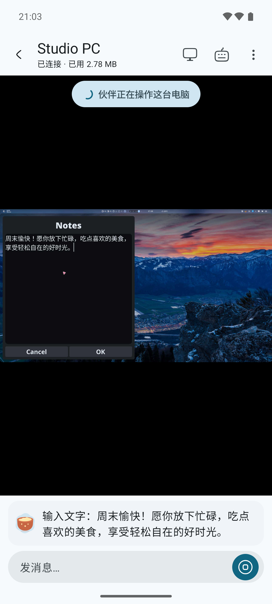
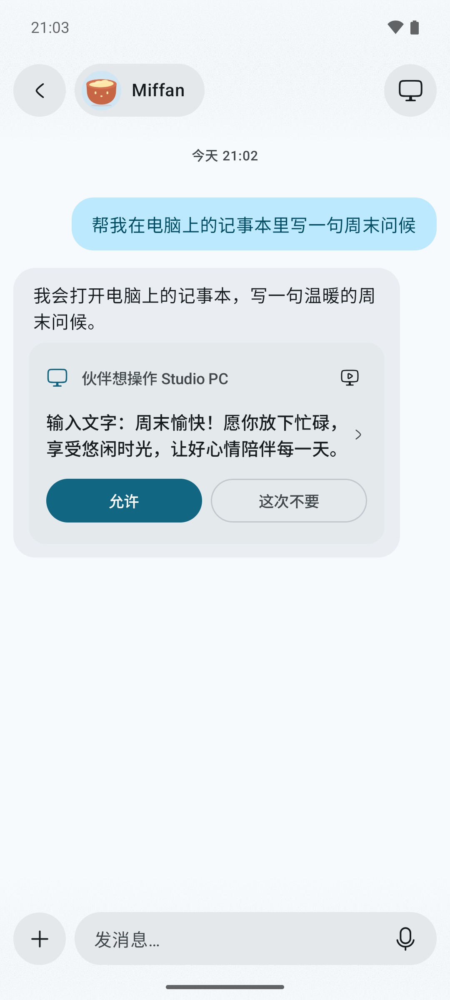
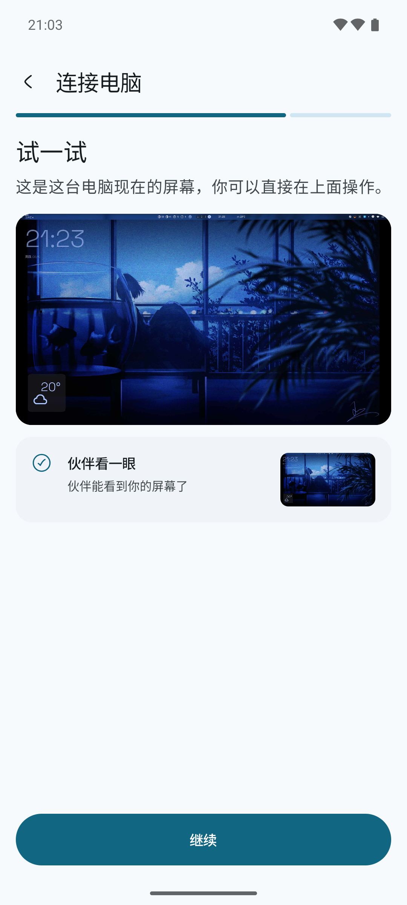

<div align="center">
  
  <h1>Miffan</h1>
  <p>像和朋友聊天一样用 AI，还能让它替你操作电脑的 Android 应用。</p>

  <p>
    <a href="https://github.com/Ayuilos/Miffan/releases"></a>
    
    <a href="LICENSE"></a>
  </p>

  <p><a href="README.md">English</a> · 简体中文 · <a href="README_ZH_TW.md">繁體中文</a></p>
</div>

<table>
  <tr>
    <td align="center" valign="top"></td>
    <td align="center" valign="top"></td>
    <td align="center" valign="top"></td>
  </tr>
</table>

用你已经在用的 AI 服务就行：OpenAI 兼容、Gemini 或 Claude 服务的 API Key，或者通过 Codex 登录 ChatGPT 订阅。Miffan 不内置模型，聊天记录和设置都保存在你的手机上。

## 像发消息一样聊天

每个 AI 伙伴就是一个持续的聊天。不用新建对话，不用选模型，也不用调参数。

- **一个伙伴，一段对话。** 和伙伴的聊天记录跨越多天也是一条时间线。Miffan 会在背后把不同话题分开，长聊天依然又快又切题。
- **同时问好几件事。** 不相关的问题会并行回答，每条回复都引用它回答的那条消息。
- **说一句话就能调整伙伴。** 比如“回答短一点”，伙伴就会调整自己的偏好。伙伴设定和记忆的每次改动都关联到引起它的那条消息，保留在历史里，随时可以撤销。
- **看看 AI 记住了你什么。** 每条记忆都能看到来源，随时可以删除。

## 让伙伴操作你的电脑 · 4.0 新功能

通过 SSH（包括 Tailscale）连接一台 Mac 或 Linux 桌面电脑，伙伴就能在上面打开应用、输入文字、点击按钮，你在手机上看着它操作。

- **同一块屏幕。** 在手机上查看并操作电脑桌面，一碰屏幕就能立刻接管。
- **由你做主。** 默认情况下，伙伴每做一步都会先问你。每次批准都记在权限记录里，删掉聊天也会保留。
- **一步步引导。** 轻松模式会带你连接电脑、检查是否就绪，再把电脑交给伙伴。

<table>
  <tr>
    <td align="center" valign="top"></td>
    <td align="center" valign="top"></td>
    <td align="center" valign="top"></td>
  </tr>
  <tr>
    <td align="center">看着它操作</td>
    <td align="center">每一步先问你</td>
    <td align="center">几步就能连上</td>
  </tr>
</table>

支持的桌面：macOS、基于 wlroots 的 Linux Wayland（如 niri、Sway、Hyprland）以及 X11。暂不支持 GNOME 和 KDE。

## 需要时切换到专业模式

随时可以切换到专业模式，它和轻松模式共用同一份数据。

- 混用官方 API、兼容网关、自建服务和 Codex 订阅。
- 为每个助手单独配置提示词、模型参数、记忆、MCP 服务器、Skills 和联网搜索。
- 在手机上运行本地 Linux 工作空间，或让助手通过 SSH 在远程服务器上处理文件、使用终端。
- 语音输入与朗读、在任意应用中划词翻译，还能在同一网络里用浏览器聊天。

完整的服务商、搜索、语音和工具支持情况见[功能矩阵](docs/FEATURE_MATRIX.md)。

## 有表情的角色

<p align="center">
  
</p>

你可以选择 Miffan 饭碗，或者蓝色大肥鱼。它们的表情会跟着对话变化：等待时吃饭，AI 思考时转圈圈眼，回复到达时露出笑容，夜里还会打瞌睡。

## 开始使用

1. 从 [GitHub Releases](https://github.com/Ayuilos/Miffan/releases) 下载最新 APK。正式版适用于 Android 8.0 及以上的 `arm64-v8a` 设备。
2. 首次打开时，用 API Key 或支持的账号连接一个 AI 服务。
3. 开始聊天。

数据可以备份到 WebDAV 或 S3 兼容存储，也可以从 RikkaHub、Chatbox 和 Cherry Studio 导入。提示词、附件和工具数据只会发给你配置的服务，详见 [PRIVACY.md](PRIVACY.md) 和 [SECURITY.md](SECURITY.md)。

## 项目历史

Miffan 最初是开源 Android LLM 客户端 [RikkaHub](https://github.com/rikkahub/rikkahub) 的一个 fork，后来逐渐发展成独立的应用。

| 时间 | 版本 | 变化 |
| --- | --- | --- |
| 2026 年 8 月 | 2.4.10-miffan.1 | 基于 RikkaHub 2.4.10 分出，更名为 Miffan，并使用独立的应用 ID，可与 RikkaHub 同时安装。新增通过 Codex 登录 ChatGPT 订阅。 |
| 2026 年 8 月 | 2.4.10-miffan.5 | 加入会动的 Miffan 饭碗角色。 |
| 2026 年 8 月 | 3.0.0 | 改用 Miffan 自己的版本号，不再跟随 RikkaHub 的版本。 |
| 2026 年 9 月 | 3.1 – 3.3 | 首次设置引导、凭据加密、持久保存的回复分支，以及蓝色大肥鱼。 |
| 2026 年 9 月 | 3.4 | 远程 SSH 工作空间。 |
| 2026 年 10 月 | 4.0 | 轻松模式，以及让伙伴操作你的电脑。 |

Miffan 仍会选择性吸收 RikkaHub 的改进，每一项都经过审查，并在发布说明中单独列出（见[上游同步策略](docs/upstream-sync.md)）。项目依照许可证保留上游的版权与署名信息。Miffan 不是 RikkaHub 的官方版本。

## 构建与参与贡献

```bash
git clone https://github.com/Ayuilos/Miffan.git
cd Miffan
./gradlew assembleDebug
```

项目使用 Kotlin、Jetpack Compose 和 Java 17。提交 PR 前请先阅读[贡献指南](CONTRIBUTING.md)和[Issue 指南](docs/ISSUE_GUIDELINES.md)。发布与签名流程见 [docs/releasing.md](docs/releasing.md)。

Miffan 以 [GNU Affero General Public License v3.0](LICENSE) 授权发布。
