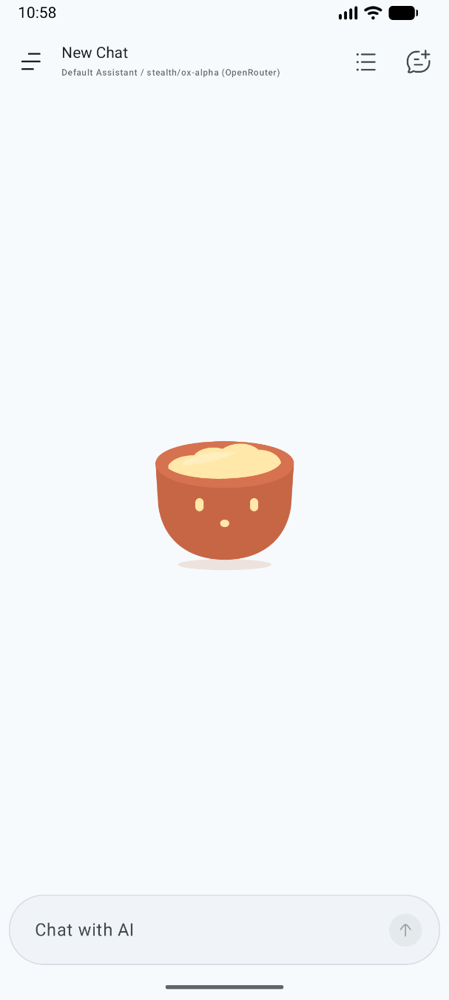
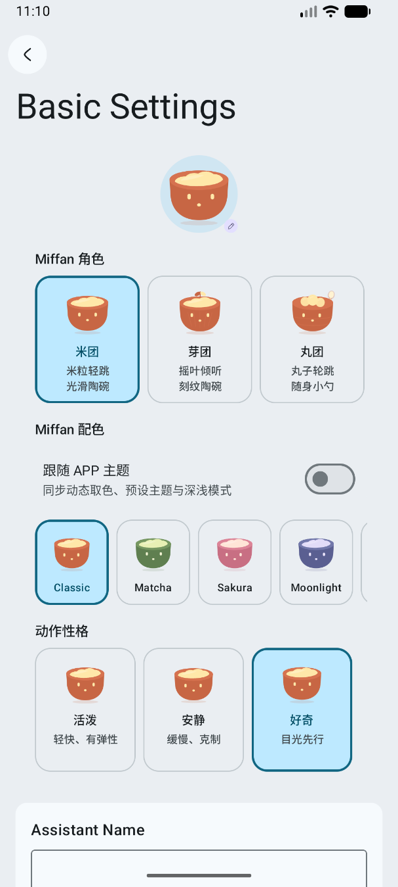
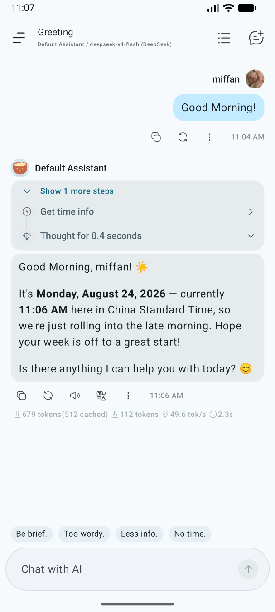
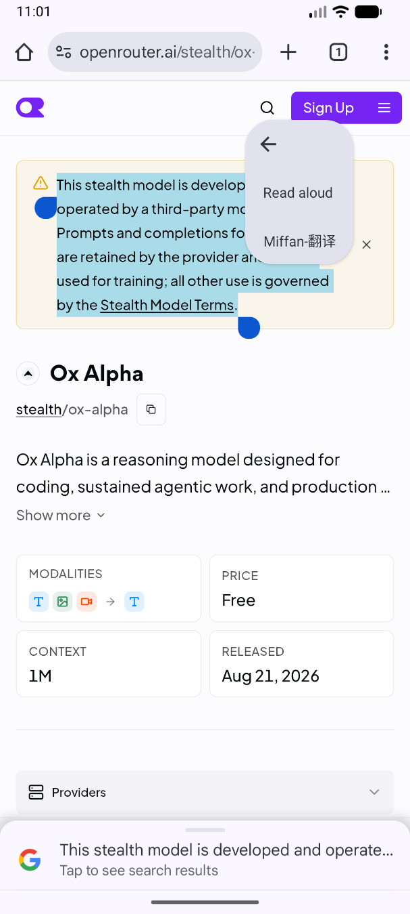
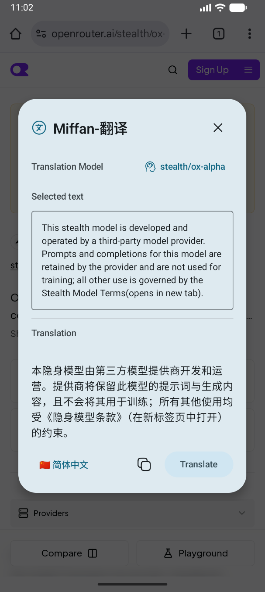

<div align="center">
  
  <h1>Miffan</h1>
  <p>把模型、助理、工具與本機工作區帶進手機的原生 Android AI 用戶端。</p>

  <p>
    <a href="https://github.com/Ayuilos/Miffan/releases"></a>
    
    <a href="LICENSE"></a>
  </p>

  <p><a href="README.md">English</a> · <a href="README_ZH_CN.md">简体中文</a> · 繁體中文</p>
</div>

Miffan 是為 Android 打造的開源 AI 工作空間。你可以連接自己正在使用的模型服務，為不同助理設定獨立的提示詞、記憶、工具和性格，並在一個原生 APP 中管理對話與檔案。

你可以透過 API Key 連接 OpenAI 相容、Gemini 或 Claude 服務，也可以使用符合條件的 ChatGPT 訂閱登入 Codex。Miffan 本身不內建模型，也不取代模型服務帳號；實際可用能力和費用取決於你設定的服務。

## 為什麼選擇 Miffan

- **不同模型，一個入口。** 官方 API、相容閘道、自行部署的端點和 Codex 訂閱可以共存，不必把工作流程綁定在單一供應商上。
- **助理不只是提示詞。** 每個助理都能擁有獨立的模型參數、記憶、工具、MCP、Skills、視覺形象與對話記錄。
- **手機不只是聊天視窗。** Miffan 可以搜尋網頁、處理檔案、執行本機 Linux 工作區、使用裝置能力，還能透過瀏覽器存取同一套對話。
- **有意義的角色系統。** 動態 Miffan 角色會回應時間、輸入、生成與錯誤狀態，並可依助理分別自訂。

## 介面預覽

<table>
  <tr>
    <td align="center"></td>
    <td align="center"></td>
    <td align="center"></td>
  </tr>
  <tr>
    <td align="center">動態角色</td>
    <td align="center">角色自訂</td>
    <td align="center">工具呼叫</td>
  </tr>
</table>

### 選取文字翻譯流程

在任何 Android APP 中選取文字，從文字操作選單選擇 **Miffan-翻譯**，即可在不離開目前頁面的情況下，透過小型浮動視窗查看翻譯結果。

<table>
  <tr>
    <td align="center"></td>
    <td align="center"></td>
  </tr>
  <tr>
    <td align="center">1. 選取文字並選擇 Miffan-翻譯</td>
    <td align="center">2. 查看或複製翻譯結果</td>
  </tr>
</table>

## 功能

### 模型與供應商

- 支援 OpenAI Chat Completions / Responses 相容服務、Google Gemini / Vertex AI，以及 Anthropic Claude 相容服務
- 使用符合條件的 ChatGPT 訂閱，透過瀏覽器登入 OpenAI Codex
- 內建常見官方服務與閘道預設，也可自訂供應商、Base URL、模型、請求路徑、Headers 與 Body 參數
- 支援模型探索，並可設定模態、推理、工具呼叫、上下文視窗與生成參數
- 支援具備驗證的 HTTP/SOCKS5 Proxy、自訂 User-Agent、連線測試和選用的餘額查詢
- 依照模型能力提供聊天、推理、工具呼叫、圖片生成與多模態輸入

### 對話體驗

- 串流輸出、訊息編輯與重新生成、回覆分支、收藏、資料夾和本機全文搜尋
- 對話層級系統提示詞、記錄壓縮、自動標題、後續建議、Token 用量與生成統計
- 支援圖片和文件附件；需要時可在本機擷取 PDF、DOCX、PPTX 與 EPUB 文字
- 豐富的 Markdown 與 HTML 呈現，支援程式碼醒目提示、LaTeX、表格、Mermaid、圖片與 Diff
- 對話可匯出為 Markdown 或圖片，也可從 Android 分享內容並交給指定助理處理

### 助理與 Miffan 角色

- 每個助理可獨立設定模型、提示詞、取樣參數、上下文限制、自訂請求與聊天背景
- 支援記憶、參照近期對話、預設訊息、快速訊息、正規表示式轉換、模式注入與世界書
- 支援匯入 JSON 或 PNG 格式的 Tavern 角色卡
- 四種 Miffan 角色、六套精選配色、三種動作風格，並可選擇跟隨 APP 主題配色
- 對應待機、思考、成功、錯誤、輸入、提交、點擊與晝夜場景的語意動畫，並支援減少動態效果

### 工具與擴充

- 支援透過 SSE 或 Streamable HTTP 連接 MCP，包括 OAuth 流程和依助理選擇伺服器
- 可從檔案、GitHub 儲存庫和 Skill.sh 目錄安裝並管理 Skills，並對安裝目標進行約束
- 可連接 Bing、Tavily、Exa、SearXNG、Brave、Perplexity、Firecrawl、Jina、Grok 等搜尋服務，也支援自訂 JavaScript 搜尋介面卡
- 選用的本機工具包括時間、剪貼簿、JavaScript、文字轉語音、向使用者提問、螢幕使用時間與行事曆事件
- 隔離的本機 Linux 工作區，包含檔案管理、編輯器、終端機、工作目錄上下文與 AI 檔案/命令工具

### 語音、翻譯與瀏覽器存取

- 可設定 OpenAI Realtime、DashScope、火山引擎、MiMo 與階躍星辰語音辨識
- 支援 Android 系統語音，以及 OpenAI、OpenRouter、Gemini、MiniMax、Qwen、Groq、xAI、MiMo、ElevenLabs、Fish Audio、階躍星辰等 TTS 服務
- 內建 AI 翻譯，並支援透過 Android「處理文字」在小型浮動視窗中翻譯選取文字
- 選用的本機 Web 伺服器，支援本機或區域網路瀏覽器存取、密碼驗證、僅本機監聽與 mDNS 探索

### 資料與移轉

- 對話與設定儲存在 APP 本機資料庫中
- 支援選擇內容的本機備份與還原、備份提醒、WebDAV 和 S3 相容儲存空間
- 可從 Chatbox 匯入供應商與完整對話、從 Cherry Studio 匯入供應商，也可匯入相容的 RikkaHub 備份
- 使用獨立的應用程式 ID、簽署身分、發布管道與 Deep Link，可與 RikkaHub 同時安裝

完整的模型協定、搜尋、語音、工具與移轉支援情況見[功能相容矩陣](docs/FEATURE_MATRIX.md)。

## 下載與首次設定

Miffan 目前透過 [GitHub Releases](https://github.com/Ayuilos/Miffan/releases) 發布簽署 APK。正式版本適用於執行 Android 8.0 或更新版本的 `arm64-v8a` 裝置。

1. 安裝最新的 Miffan APK。
2. 開啟 **設定 → 供應商** 設定模型服務，或使用支援的訂閱登入 OpenAI Codex。
3. 新增或探索模型，再將其設為全域模型或某個助理的專用模型。
4. 僅在需要時啟用搜尋、MCP、Skills、本機工具或工作區。

Miffan 的應用程式 ID 為 `me.ayuilos.miffan.app`，Deep Link 協定為 `miffan://`。RikkaHub 的既有資料不會自動共享；如需移轉，請先在舊 APP 中匯出備份，再匯入 Miffan。

## 安全與隱私說明

Miffan 是用戶端：提示詞、附件和工具資料會傳送到你選擇的模型、搜尋、語音、MCP、同步或其他服務端點。請分別了解所設定服務的隱私權政策和計費方式。詳細資料流說明見 [PRIVACY.md](PRIVACY.md)。

Skills、MCP 伺服器、本機工具與工作區可能在授權範圍內存取外部服務或裝置資料。請只安裝可信任的 Skills、檢查工具請求，並只為助理開啟必要能力。

在開啟區域網路存取、執行工作區指令或儲存敏感憑證前，請閱讀 [SECURITY.md](SECURITY.md)。

## 從原始碼建置

專案使用 Kotlin、Jetpack Compose、Material 3、Gradle 與 Java 17。

```bash
git clone https://github.com/Ayuilos/Miffan.git
cd Miffan
./gradlew assembleDebug
```

常用驗證命令：

```bash
./gradlew test
./gradlew lint
```

`app/google-services.json` 是選用設定。沒有經過授權的設定時，Firebase 使用情況分析與當機回報會保持關閉。正式簽署與發布流程請參閱 [docs/releasing.md](docs/releasing.md)。

### 儲存庫模組

| 模組 | 職責 |
| --- | --- |
| `app` | Compose UI、資料、助理、對話、工具與應用程式服務 |
| `ai` | 供應商抽象層以及 OpenAI、Gemini、Claude 協定實作 |
| `search` | 網頁搜尋與頁面內容服務整合 |
| `speech` | 語音辨識、合成與播放 |
| `document` | PDF、DOCX、PPTX 與 EPUB 文字擷取 |
| `workspace` | 隔離的本機檔案系統與 Shell 環境 |
| `web` / `web-ui` | 內建伺服器與瀏覽器用戶端 |
| `highlight`、`material3`、`common` | 呈現與共用基礎設施 |

## 專案歷史與歸屬

Miffan 最初源自 [RikkaHub](https://github.com/rikkahub/rikkahub) 的社群分支，並會繼續選擇性吸收上游改進。現在它作為獨立應用程式維護，擁有自己的產品定位、角色系統、套件名稱、簽署憑證、發布版本線與功能開發方向。

專案會依照授權條款保留上游版權與歸屬資訊。Miffan 不是 RikkaHub 的官方版本。

## 參與貢獻

歡迎提交 Issue 與 Pull Request。對於較大的改動，建議先建立 Issue 討論產品方向和實作範圍。回報問題時請附上 Miffan 版本、Android 版本、供應商類型和重現步驟，並移除 API Key 與私人對話內容。

## 授權條款

Miffan 使用 [GNU Affero General Public License v3.0](LICENSE) 發布。
