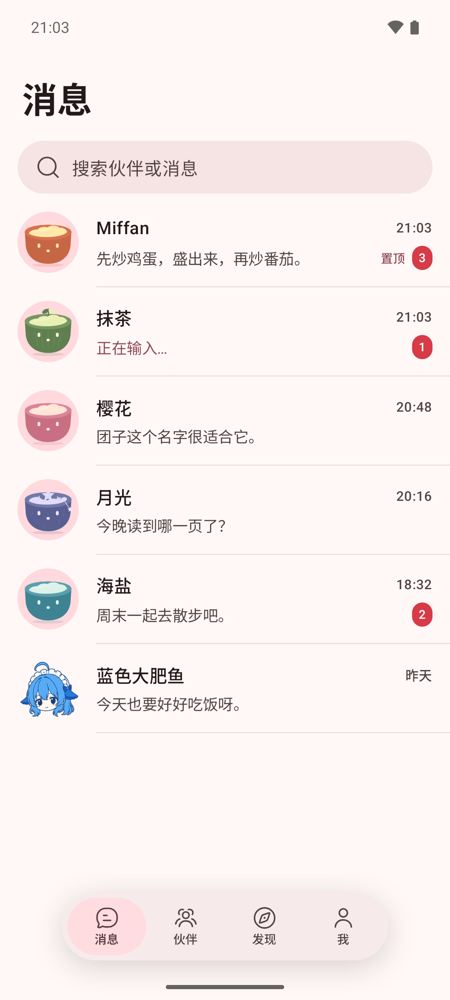
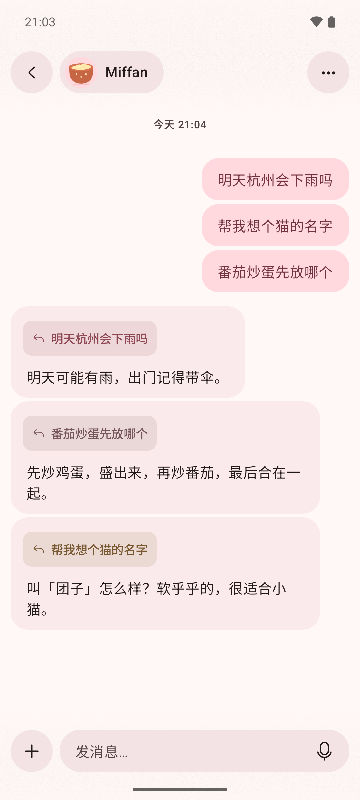
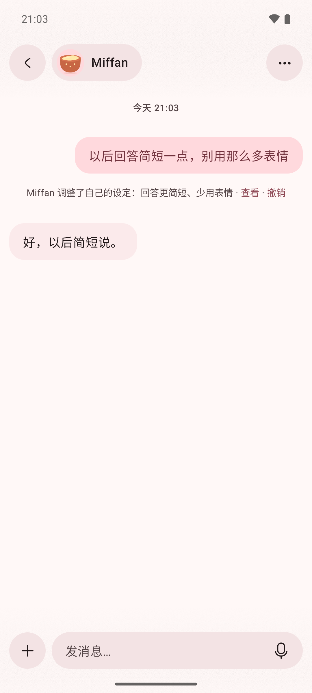

<div align="center">
  
  <h1>Miffan</h1>
  <p>像和朋友聊天一樣使用 AI，還能讓它替你操作電腦的 Android 應用程式。</p>

  <p>
    <a href="https://github.com/Ayuilos/Miffan/releases"></a>
    
    <a href="LICENSE"></a>
  </p>

  <p><a href="README.md">English</a> · <a href="README_ZH_CN.md">简体中文</a> · 繁體中文</p>
</div>

<table>
  <tr>
    <td align="center" valign="top"></td>
    <td align="center" valign="top"></td>
    <td align="center" valign="top"></td>
  </tr>
</table>

用你已經在用的 AI 服務就好：OpenAI 相容、Gemini 或 Claude 服務的 API Key，或透過 Codex 登入 ChatGPT 訂閱。Miffan 不內建模型，聊天紀錄和設定都保存在你的手機上。

## 像傳訊息一樣聊天

每個 AI 夥伴就是一段持續的聊天。不用新增對話，不用選模型，也不用調參數。

- **一個夥伴，一段對話。** 和夥伴的聊天紀錄跨越多天也是一條時間軸。Miffan 會在背後把不同話題分開，長聊天依然又快又切題。
- **同時問好幾件事。** 不相關的問題會並行回答，每則回覆都會引用它回答的那則訊息。
- **說一句話就能調整夥伴。** 例如「回答短一點」，夥伴就會調整自己的偏好。夥伴設定和記憶的每次變更都關聯到引起它的那則訊息，保留在歷史紀錄裡，隨時可以復原。
- **看看 AI 記住了你什麼。** 每則記憶都能看到來源，隨時可以刪除。

## 讓夥伴操作你的電腦 · 4.0 新功能

透過 SSH（包括 Tailscale）連接一台 Mac 或 Linux 桌上型電腦，夥伴就能在上面開啟應用程式、輸入文字、點擊按鈕，你在手機上看著它操作。

- **同一個畫面。** 在手機上查看並操作電腦桌面，一碰螢幕就能立刻接管。
- **由你作主。** 預設情況下，夥伴每做一步都會先問你。每次核准都記在權限紀錄裡，刪除聊天也會保留。
- **一步步引導。** 輕鬆模式會帶你連接電腦、檢查是否就緒，再把電腦交給夥伴。

支援的桌面：macOS、基於 wlroots 的 Linux Wayland（如 niri、Sway、Hyprland）以及 X11。暫不支援 GNOME 和 KDE。

## 需要時切換到專業模式

隨時可以切換到專業模式，它和輕鬆模式共用同一份資料。

- 混用官方 API、相容閘道、自架服務和 Codex 訂閱。
- 為每個助理分別設定提示詞、模型參數、記憶、MCP 伺服器、Skills 和網路搜尋。
- 在手機上執行本機 Linux 工作空間，或讓助理透過 SSH 在遠端伺服器上處理檔案、使用終端機。
- 語音輸入與朗讀、在任何應用程式中選取文字翻譯，還能在同一個網路裡用瀏覽器聊天。

完整的服務商、搜尋、語音和工具支援情況請見[功能矩陣](docs/FEATURE_MATRIX.md)。

## 有表情的角色

<p align="center">
  
</p>

你可以選擇 Miffan 飯碗，或是藍色大肥魚。它們的表情會跟著對話變化：等待時吃飯，AI 思考時轉圈圈眼，回覆送達時露出笑容，夜裡還會打瞌睡。

## 開始使用

1. 從 [GitHub Releases](https://github.com/Ayuilos/Miffan/releases) 下載最新 APK。正式版適用於 Android 8.0 以上的 `arm64-v8a` 裝置。
2. 第一次開啟時，用 API Key 或支援的帳號連接一個 AI 服務。
3. 開始聊天。

資料可以備份到 WebDAV 或 S3 相容儲存空間，也可以從 RikkaHub、Chatbox 和 Cherry Studio 匯入。提示詞、附件和工具資料只會傳送給你設定的服務，詳見 [PRIVACY.md](PRIVACY.md) 和 [SECURITY.md](SECURITY.md)。

## 專案歷史

Miffan 最初是開源 Android LLM 用戶端 [RikkaHub](https://github.com/rikkahub/rikkahub) 的一個 fork，後來逐漸發展成獨立的應用程式。

| 時間 | 版本 | 變化 |
| --- | --- | --- |
| 2026 年 8 月 | 2.4.10-miffan.1 | 基於 RikkaHub 2.4.10 分出，更名為 Miffan，並使用獨立的應用程式 ID，可與 RikkaHub 同時安裝。新增透過 Codex 登入 ChatGPT 訂閱。 |
| 2026 年 8 月 | 2.4.10-miffan.5 | 加入會動的 Miffan 飯碗角色。 |
| 2026 年 8 月 | 3.0.0 | 改用 Miffan 自己的版本號，不再跟隨 RikkaHub 的版本。 |
| 2026 年 9 月 | 3.1 – 3.3 | 首次設定引導、憑證加密、持久保存的回覆分支，以及藍色大肥魚。 |
| 2026 年 9 月 | 3.4 | 遠端 SSH 工作空間。 |
| 2026 年 10 月 | 4.0 | 輕鬆模式，以及讓夥伴操作你的電腦。 |

Miffan 仍會選擇性吸收 RikkaHub 的改進，每一項都經過審查，並在發布說明中單獨列出（見[上游同步策略](docs/upstream-sync.md)）。專案依照授權條款保留上游的著作權與署名資訊。Miffan 不是 RikkaHub 的官方版本。

## 建置與參與貢獻

```bash
git clone https://github.com/Ayuilos/Miffan.git
cd Miffan
./gradlew assembleDebug
```

專案使用 Kotlin、Jetpack Compose 和 Java 17。提交 PR 前請先閱讀[貢獻指南](CONTRIBUTING.md)和 [Issue 指南](docs/ISSUE_GUIDELINES.md)。發布與簽署流程請見 [docs/releasing.md](docs/releasing.md)。

Miffan 以 [GNU Affero General Public License v3.0](LICENSE) 授權發布。
